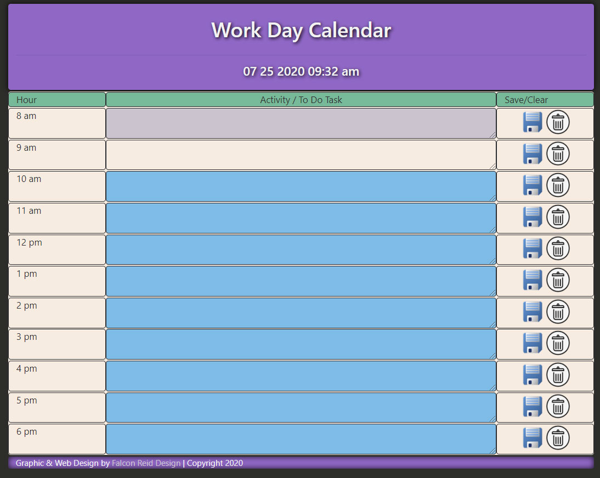

# 5-Work-Day-Scheduler

I created a simple calendar application that allows the user to save events for each hour of the day. This app runs in the browser and features dynamically updated HTML and CSS powered by jQuery and JavaScript.

Task Columns change color based on the time. Present is a linen color, past is grey and future is a light blue.

Save button sends data to localStorage for each corresponding task
Delete button removes data from localStorage for each corresponding task

work day from 8 - 6 depending on varying schedule

integrated Moment.js to display time at the top and check present time to determine color of task column

- I had an issue with github where I deleted some comments in the master and didn't push it. By the time I realized that I couldn't push to github without merging (which I couldn't figure out) I was halfway through the project. I deleted the master and started over.

live:
https://falconreid.github.io/5-Work-Day-Scheduler/

repo:
https://github.com/falconreid/5-Work-Day-Scheduler
